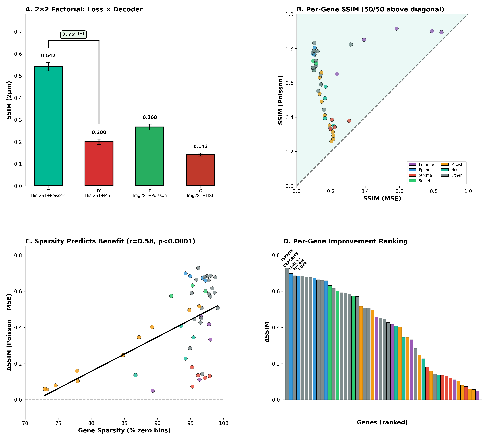

# The Sparsity Trap

**Why MSE Fails and Poisson Succeeds for 2μm Spatial Transcriptomics Prediction**

[](https://arxiv.org/abs/XXXX.XXXXX)
[](LICENSE)
[](https://doi.org/10.5281/zenodo.XXXXXXX)

> **TL;DR:** MSE loss collapses to "gray fog" on 2μm sparse spatial transcriptomics. Poisson NLL achieves 2.7× better SSIM by avoiding the sparsity trap. **All 50 genes benefit.**

---

## Key Finding

<p align="center">
  
</p>

At 2μm resolution (Visium HD), ~95% of spatial bins contain **zero UMI counts**. This extreme sparsity creates a fundamental failure mode for MSE loss:

- **MSE Loss:** Predicting zero everywhere minimizes loss → "gray fog"
- **Poisson NLL:** Infinite penalty for λ→0 when k>0 → preserves structure

**Result:** 2.7× SSIM improvement (0.200 → 0.542, p<0.001), 50/50 genes benefit

---

## Visual Evidence

<p align="center">
  
</p>

**Epithelial markers** show dramatic recovery of glandular architecture. MSE produces featureless predictions, while Poisson captures crypt boundaries and lumen structures.

---

## Main Results

### Model Performance (3-Fold Cross-Validation)

| Model | Decoder | Loss | SSIM 2μm | PCC 2μm | Rank |
|-------|---------|------|----------|---------|------|
| **E'** | **Hist2ST** | **Poisson** | **0.542 ± 0.019** | **0.151** | 🥇 |
| F | Img2ST | Poisson | 0.268 ± 0.013 | ~0.00 | 🥈 |
| D' | Hist2ST | MSE | 0.200 ± 0.012 | 0.111 | 🥉 |
| G | Img2ST | MSE | 0.142 ± 0.007 | -0.006 | 💀 |

### Key Statistics

- **SSIM Improvement:** 2.7× (MSE → Poisson with Hist2ST)
- **Genes Benefiting:** 50/50 (100%)
- **Mean Δ-SSIM:** +0.412
- **Sparsity Correlation:** r=0.577, p<0.0001 (sparser genes benefit more)

---

## Installation

```bash
git clone https://github.com/vanbelkummax/sparsity-trap-publication.git
cd mse-vs-poisson-2um-benchmark
conda env create -f environment.yml
conda activate sparsity-trap
pip install -e .
```

**Requirements:** Python 3.10+, PyTorch 2.0+, NVIDIA GPU with 24GB+ VRAM

---

## Quick Start

### Reproduce All Results

```bash
bash scripts/reproduce_paper.sh
```

This trains all 12 models (4 configs × 3 folds), generates figures, and compiles the manuscript.

**Estimated time:** 18-24 hours on RTX 5090

### Train Single Model

```bash
# Best model: Hist2ST + Poisson
python scripts/train_factorial.py --decoder hist2st --loss poisson --fold 1

# Worst model: Img2ST + MSE
python scripts/train_factorial.py --decoder img2st --loss mse --fold 1
```

### Generate Figures

```bash
python scripts/generate_figures.py
```

Outputs: `figures/manuscript/*.png`

---

## Repository Structure

```
mse-vs-poisson-2um-benchmark/
├── paper/                  # LaTeX manuscript
│   ├── main.tex
│   ├── main.bib
│   └── supplementary.tex
├── src/                    # Source code
│   ├── models/             # Loss functions, encoders, decoders
│   ├── data/               # Dataset, preprocessing
│   ├── training/           # Trainer, callbacks
│   └── evaluation/         # Metrics, visualization
├── tests/                  # Unit & integration tests
├── scripts/                # Training & evaluation scripts
├── figures/                # Publication figures
├── tables/                 # Per-gene metrics, summaries
├── results/                # Model checkpoints (gitignored)
└── docs/                   # Documentation
    ├── REPRODUCTION.md     # Step-by-step reproduction
    └── ARCHITECTURE.md     # Model architecture details
```

---

## Citation

If you use this work, please cite:

```bibtex
@software{vanbelkum2025sparsity_trap,
  author = {Van Belkum, Max},
  title = {The Sparsity Trap: Why MSE Fails and Poisson Succeeds for 2μm Spatial Transcriptomics},
  year = {2025},
  url = {https://github.com/vanbelkummax/sparsity-trap-publication},
  doi = {10.XXXXX/XXXXX}
}
```

---

## Related Work

This work builds upon:

- **Huo et al. (2025):** [Img2ST-Net](https://doi.org/10.1117/1.JMI.12.6.061410) - Baseline using MSE at 8-16μm
- **Lau et al. (2022):** [CRC Spatial Atlas](https://doi.org/10.1186/s12967-022-03510-8) - Dataset context
- **Sarkar et al. (2023):** [Spatial gene expression mapping](https://doi.org/10.1038/s41587-023-01961-z) - Related methods

---

## License

MIT License - see [LICENSE](LICENSE) for details

---

## Acknowledgments

This work was supported by the Vanderbilt MD-PhD Program. We thank:

- **Yuankai Huo** (Vanderbilt) - Spatial transcriptomics methods
- **Ken Lau** (Vanderbilt) - CRC spatial biology
- **Bennett Landman** (Vanderbilt) - Medical imaging

---

## Contact

**Max Van Belkum**
MD-PhD Student, Vanderbilt University Medical Center
Email: max.vanbelkum@vanderbilt.edu
GitHub: [@vanbelkummax](https://github.com/vanbelkummax)

For questions or issues, please [open a GitHub issue](https://github.com/vanbelkummax/sparsity-trap-publication/issues).
