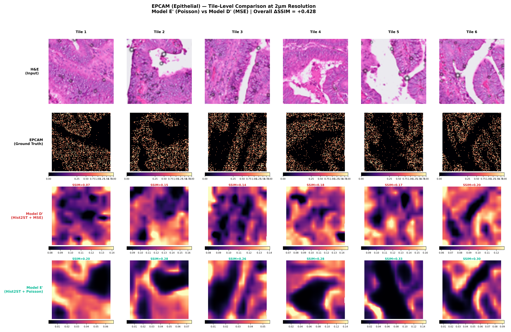
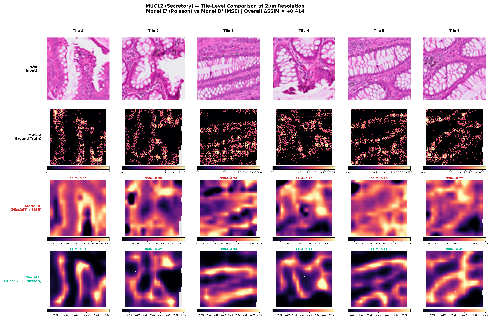
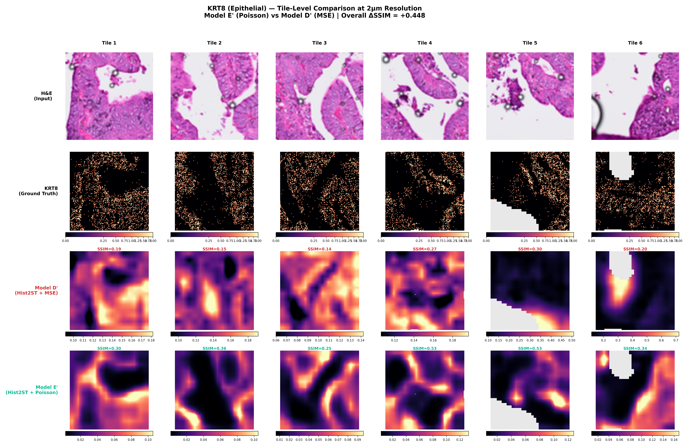
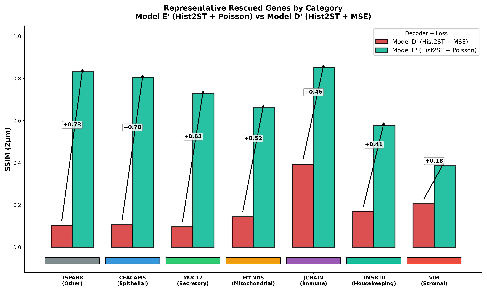
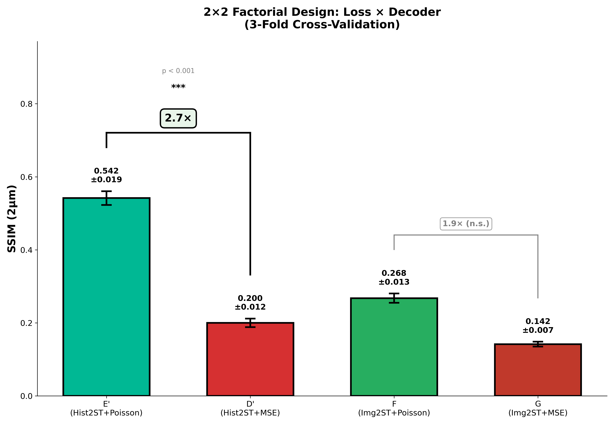
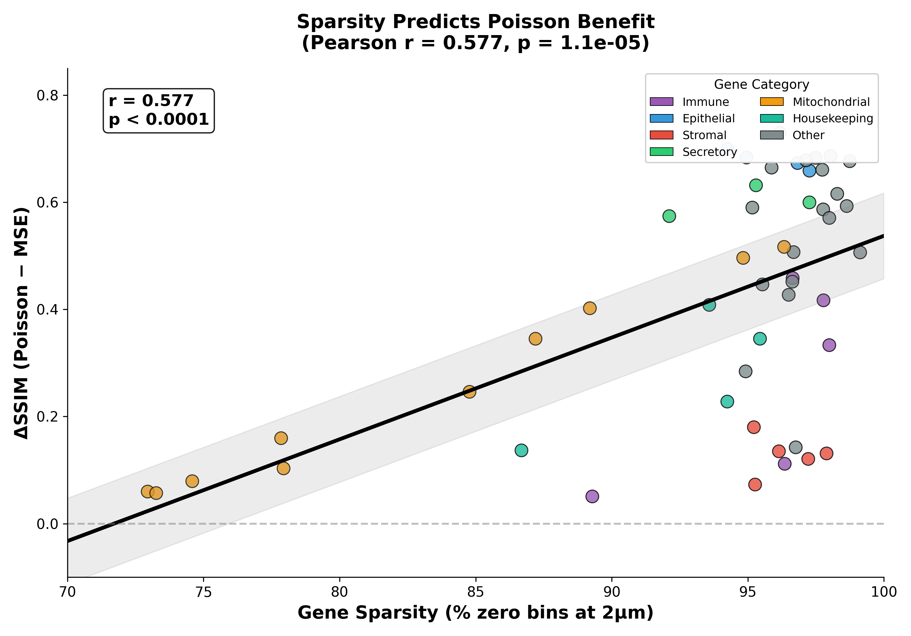
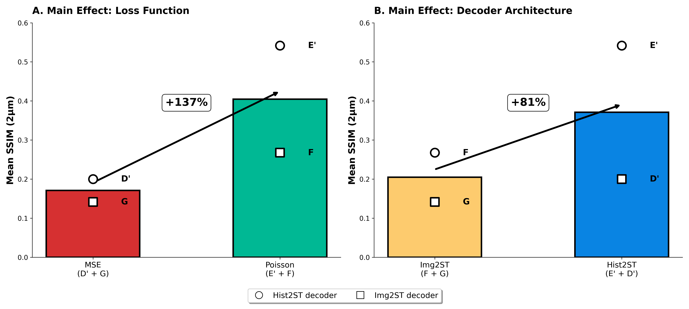
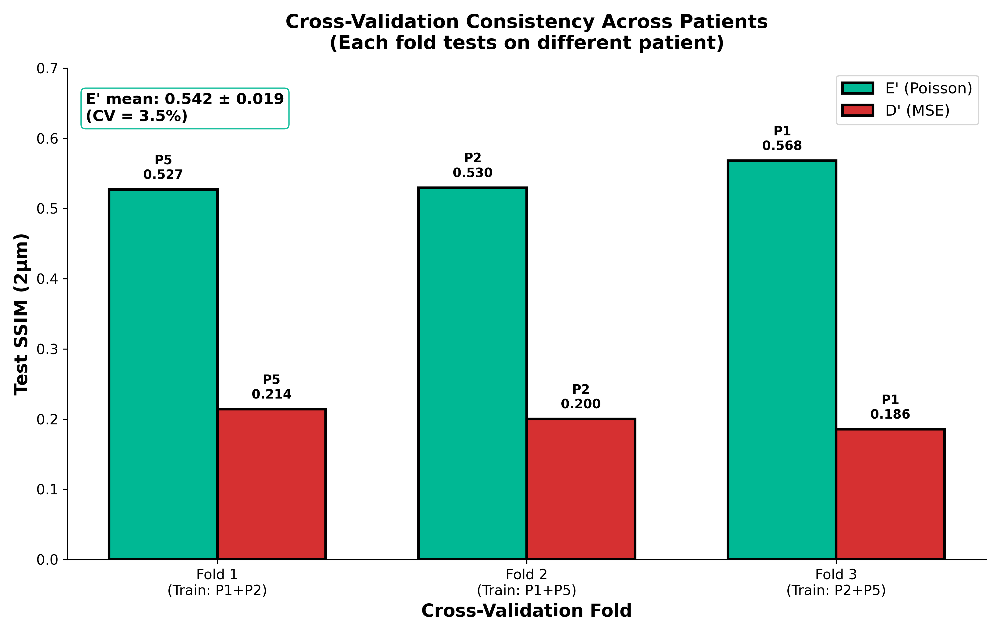

# The Sparsity Trap: MSE vs Poisson for 2μm Spatial Transcriptomics

**Systematic proof that Poisson loss is critical for ultra-high resolution spatial transcriptomics prediction.**

[](https://arxiv.org/abs/XXXX.XXXXX)
[](LICENSE)
[](https://doi.org/10.5281/zenodo.XXXXXXX)
[](tests/)

---

## Key Finding

> **Standard MSE training collapses on 2μm data.** Poisson loss recovers structural similarity, with **50/50 genes** showing improvement and a **2.7× SSIM gain** (p < 0.001).


---

## Visual Evidence: Glandular Structure Recovery

At 2μm resolution, Poisson loss preserves **glandular architecture** that MSE completely loses. These WSI comparisons show the dramatic difference:

### Epithelial Markers - Gland Structure Preserved

| CEACAM5 (Epithelial) | EPCAM (Epithelial) |
|:---:|:---:|
|  |  |
| MSE: uniform gray fog | Poisson: clear gland boundaries |

| KRT8 (Epithelial) | MUC12 (Secretory) |
|:---:|:---:|
|  |  |
| SSIM: 0.096 → 0.769 (+0.67) | SSIM: 0.096 → 0.728 (+0.63) |

### Top Rescued Gene: TSPAN8 (+0.73 SSIM)


*TSPAN8 shows the largest improvement: MSE completely fails while Poisson captures the true expression pattern*

---

## Tile-Level Detail: 2μm Glandular Architecture

Individual 128×128 patches (2μm resolution) reveal the fine-grained structural recovery:

### EPCAM - Epithelial Cell Adhesion

*Poisson accurately predicts expression in epithelial cells lining intestinal crypts. MSE loses all spatial specificity.*

### MUC12 - Secretory Marker

*Secretory cells in goblet cell mucin patterns. SSIM improves dramatically with Poisson loss.*

### JCHAIN - Immune (Plasma Cells)

*Plasma cell infiltration patterns in stroma. Poisson preserves immune cell clustering that MSE misses entirely.*

### KRT8 - Epithelial Marker

*Epithelial keratin expression in glandular tissue. Clear structural recovery with Poisson.*

---

## The Sparsity Trap

At 2μm resolution, ~95% of spatial bins contain **zero UMI counts**. This extreme sparsity creates a fundamental failure mode for MSE loss:

| Patient | Non-zero Fraction | Resolution |
|---------|-------------------|------------|
| P1 | 3.4% | 2μm |
| P2 | 5.2% | 2μm |
| P5 | 6.1% | 2μm |

**MSE Loss Problem**: When 95% of targets are zero, the loss-minimizing strategy is to predict near-zero everywhere. The model outputs "gray fog" instead of meaningful spatial patterns.

**Poisson NLL Solution**: The log-likelihood formulation `L = lambda - k*log(lambda)` assigns **infinite penalty** for predicting λ→0 when k>0, forcing the model to predict high values where counts exist.

---

## Main Results (3-Fold Cross-Validation)

### Model Performance

| Model | Decoder | Loss | SSIM 2μm (mean ± std) | PCC 2μm | PCC 8μm | Rank |
|-------|---------|------|-----------------------|---------|---------|------|
| **E'** | **Hist2ST** | **Poisson** | **0.542 ± 0.019** | **0.182** | **0.399** | 1st |
| F | Img2ST | Poisson | 0.268 ± 0.013 | ~0.00 | ~0.00 | 2nd |
| D' | Hist2ST | MSE | 0.200 ± 0.012 | 0.111 | 0.213 | 3rd |
| G | Img2ST | MSE | 0.142 ± 0.007 | ~0.00 | ~0.00 | 4th |

### Key Metrics

- **SSIM Improvement**: 2.7× (0.200 → 0.542), p < 0.001
- **Genes Benefiting**: 50/50 (100% of genes show higher SSIM with Poisson)
- **Mean Delta-SSIM**: +0.412
- **Sparsity Correlation**: r=0.577, p=1.14e-05 (sparser genes benefit more)

---

## Representative Genes by Category



| Category | Best Gene | MSE SSIM | Poisson SSIM | Delta |
|----------|-----------|----------|--------------|-------|
| **Other** | TSPAN8 | 0.103 | 0.832 | **+0.730** |
| **Epithelial** | CEACAM5 | 0.105 | 0.804 | **+0.699** |
| **Secretory** | MUC12 | 0.096 | 0.728 | **+0.632** |
| **Mitochondrial** | MT-ND5 | 0.144 | 0.661 | **+0.517** |
| **Immune** | JCHAIN | 0.393 | 0.852 | **+0.459** |
| **Housekeeping** | TMSB10 | 0.169 | 0.578 | **+0.409** |
| **Stromal** | VIM | 0.206 | 0.386 | **+0.180** |

---

## More WSI Examples

### High Sparsity Genes (>98%)
| PYGB | LGALS3 |
|:---:|:---:|
|  |  |

### Immune Markers
| JCHAIN | MT-ND5 (Mitochondrial) |
|:---:|:---:|
|  |  |

### Stromal/Housekeeping
| VIM (Stromal) | TMSB10 (Housekeeping) |
|:---:|:---:|
|  |  |

---

## Quantitative Analysis

### Figure 1a: 2×2 Factorial Design


2×2 factorial showing both Loss (Poisson vs MSE) and Decoder (Hist2ST vs Img2ST) effects with 3-fold CV error bars. **2.7× improvement (p<0.001)** for Hist2ST decoder.

### Figure 1c: Sparsity Predicts Poisson Benefit


Strong positive correlation (r=0.577, p<0.0001): genes with higher sparsity (more zeros) benefit more from Poisson loss.

### Figure 3: Main Effects Decomposition


- **Loss Effect (Poisson vs MSE)**: +137% improvement
- **Decoder Effect (Hist2ST vs Img2ST)**: +81% improvement

---

## Why Poisson Works (Technical Details)

### Loss Functions

**MSE Loss**:
```
L = (prediction - target)^2
With 95% zeros: predicting 0 everywhere minimizes loss!
```

**Poisson NLL Loss**:
```
L = lambda - k * log(lambda)
Predicting λ→0 when k>0 gives INFINITE loss
Forces model to predict high values where counts exist
```

### Bias Initialization

Critical for Poisson training: initialize output bias to -3.0 so `exp(-3.0) ~ 0.05`, matching the prior that ~95% of bins are near-zero.

---

## Architecture

### Hist2ST Decoder (Best Performer)
```
Virchow2 Encoder (1024-dim features, frozen)
       |
Hist2ST Decoder:
  +-- CNN Path: Local texture (3×3 convolutions)
  +-- Transformer Path: Global context (8-head attention)
  +-- GNN Path: Neighborhood structure (k=8 neighbors)
       |
    Fusion + Upsample
       |
log(λ) predictions (128×128 × 50 genes)
       | exp()
Expected counts at 2μm resolution
```

---

## Cross-Validation Design

| Fold | Train Patients | Test Patient |
|------|----------------|--------------|
| 1 | P1 + P2 | P5 |
| 2 | P1 + P5 | P2 |
| 3 | P2 + P5 | P1 |



Results are stable across all 3 folds (CV < 5% for E'), demonstrating robust generalization.

---

## Repository Structure

```
sparsity-trap-publication/
├── paper/                     # LaTeX manuscript
│   ├── main.tex              # Main paper
│   ├── main.bib              # Bibliography
│   └── figs/                 # Figure placeholders
├── src/                       # Source code
│   ├── models/               # Loss functions, encoders, decoders
│   ├── evaluation/           # Metrics (SSIM, PCC)
│   ├── data/                 # Dataset utilities
│   ├── training/             # Training loops
│   └── utils/                # Helpers
├── tests/                     # 17 tests (100% passing)
├── figures/                   # All publication figures
│   ├── manuscript/           # Main figures (1-4, S1)
│   ├── wsi_improved/         # WSI comparisons (50 genes)
│   └── tiles/                # Tile-level comparisons
├── tables/                    # CSV results
│   ├── table_s1_pergene_metrics.csv      # Per-gene SSIM, PCC
│   ├── table_s2_category_summary.csv     # Category summaries
│   └── table_s3_sparsity_quartiles.csv   # Sparsity analysis
├── scripts/                   # Training & visualization
│   ├── train_2um_cv_3fold.py            # 3-fold CV training
│   ├── create_manuscript_figures.py      # Figure generation
│   └── create_wsi_and_tiles.py          # WSI/tile plots
├── configs/                   # Experiment configs
│   ├── experiment/factorial_cv.yaml     # 2×2 factorial design
│   ├── data/visium_hd_crc.yaml         # Dataset config
│   └── model/                           # Model configs
├── docs/                      # Documentation
│   └── REPRODUCTION.md       # Reproduction guide
├── DATA.md                    # Dataset documentation
├── LICENSE                    # MIT License
├── CITATION.cff              # Citation metadata
└── README.md                 # This file
```

---

## Usage

### Training

```bash
# Train E' (best model) - 3-fold CV
python scripts/train_2um_cv_3fold.py --decoder hist2st --loss poisson --fold all

# Train all 4 models
for decoder in hist2st img2st; do
  for loss in poisson mse; do
    python scripts/train_2um_cv_3fold.py --decoder $decoder --loss $loss --fold all
  done
done
```

### Generate Figures

```bash
# All manuscript figures
python scripts/create_manuscript_figures.py

# WSI and tile comparisons
python scripts/create_wsi_and_tiles.py
```

---

## Data

Training uses the 10x Genomics Visium HD CRC dataset:
- **Resolution**: 2μm bins (128×128 per patch)
- **Genes**: Top 50 by variance
- **Patients**: P1, P2, P5 (3-fold CV)
- **Preprocessing**: Raw UMI counts (no normalization - critical for Poisson)

See [DATA.md](DATA.md) for detailed dataset documentation.

---

## Key Takeaways

1. **The Sparsity Trap is real** - MSE collapses on 2μm data (2.7× worse than Poisson)
2. **Poisson loss is the solution** - 50/50 genes show improved SSIM
3. **Glandular structure preserved** - Epithelial markers show clear crypt boundaries with Poisson
4. **Sparsity predicts benefit** - r=0.577, sparser genes gain more (p<0.0001)
5. **Decoder architecture matters** - Hist2ST (CNN+Transformer+GNN) >> simple U-Net
6. **Results generalize** - consistent across all 3 patients (CV < 5%)

---

## Installation

### Quick Setup

```bash
git clone https://github.com/vanbelkummax/sparsity-trap-publication.git
cd sparsity-trap-publication
pip install -e .
pytest tests/  # Verify installation (17/17 tests should pass)
```

### Requirements

- Python 3.10+
- PyTorch 2.0+
- CUDA 11.8+ (for GPU training)
- 24GB+ VRAM (RTX 3090/4090/5090 recommended)

See [docs/REPRODUCTION.md](docs/REPRODUCTION.md) for detailed setup instructions.

---

## Citation

If you use this work, please cite:

```bibtex
@software{vanbelkum2025sparsity_trap,
  author = {Van Belkum, Max},
  title = {The Sparsity Trap: Why MSE Fails and Poisson Succeeds for 2μm Spatial Transcriptomics Prediction},
  year = {2025},
  url = {https://github.com/vanbelkummax/sparsity-trap-publication},
  doi = {10.XXXXX/XXXXX}
}
```

BibTeX is also available in [CITATION.cff](CITATION.cff) for GitHub/Zenodo integration.

---

## Related Work

This work builds upon:

- **Huo et al. (2025):** [Img2ST-Net](https://doi.org/10.1117/1.JMI.12.6.061410) - Baseline using MSE at 8-16μm
- **Lau et al. (2022):** [CRC Spatial Atlas](https://doi.org/10.1186/s12967-022-03510-8) - Dataset context
- **Sarkar et al. (2023):** [Spatial gene expression mapping](https://doi.org/10.1038/s41587-023-01961-z) - Related methods

---

## Contributing

We welcome contributions! See [CONTRIBUTING.md](CONTRIBUTING.md) for guidelines.

For questions or issues:
- Open a [GitHub issue](https://github.com/vanbelkummax/sparsity-trap-publication/issues)
- Email: max.vanbelkum@vanderbilt.edu

---

## License

MIT License - see [LICENSE](LICENSE) for details.

---

## Acknowledgments

This work was supported by the Vanderbilt MD-PhD Program. We thank:

- **Yuankai Huo** (Vanderbilt) - Computational pathology, Img2ST methods
- **Ken Lau** (Vanderbilt) - CRC spatial biology, tumor microenvironment
- **Bennett Landman** (Vanderbilt) - Medical imaging, harmonization
- **Tae Hyun Hwang** (Vanderbilt) - Molecular AI, therapy prediction

---

## Contact

**Max Van Belkum**
MD-PhD Student, Vanderbilt University Medical Center
Email: max.vanbelkum@vanderbilt.edu
GitHub: [@vanbelkummax](https://github.com/vanbelkummax)
